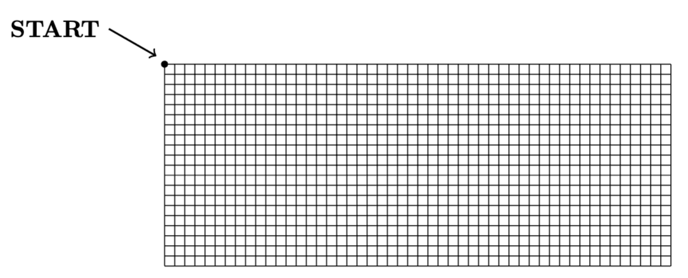

# Zastosowania probabilistyki w informatyce - Zadania projektowe

## Raport powinien zawierać:

1. opis problemu i zastosowanego modelu,
2. obliczenia analityczne (wykonane ręcznie lub za pomocą języka R),
3. kod w języku R wykorzystany do symulacji,
4. wyniki liczbowe wraz z wnioskami.

## Zadanie 1. Warsztat

W warsztacie samochodowym pracuje dwóch mechaników zajmujących się wymianą filtrów oleju. Obsługa każdego klienta składa się z trzech kolejnych etapów: diagnozy, wymiany
filtra oraz kontroli końcowej. Czas trwania każdego etapu ma rozkład wykładniczy: dla pierwszego mechanika z parametrem $λ_1 = 5 h^{−1}$, natomiast dla drugiego z parametrem $λ_2 = 20 h^{−1}$. Prawdopodobieństwo, że klient trafi do pierwszego mechanika, wynosi 0,2, a do drugiego 0,8. Niech $X$ oznacza całkowity czas obsługi jednego klienta.

1. Oblicz prawdopodobieństwoP(X > 35min). Zwróć uwagę na dobór właściwego rozkładu.
2. Oszacuj to prawdopodobieństwo metodą Monte Carlo w taki sposób, aby błąd oszacowania nie przekraczał 0,01 z prawdopodobieństwem co najmniej 0,9.
3. Zbadaj wpływ liczby przeprowadzonych symulacji na dokładność otrzymanej estymacji.

## Zadanie 2. Pożar lasu

Las składa się z 1000 drzew tworzących prostokąt o wymiarach 50x20. Pożar rozpoczyna się od drzewa znajdującego się w północno–zachodnim (lewym górnym) rogu lasu.

Przyjmujemy, że prawdopodobieństwo zapalenia się drzewa od dowolnego bezpośredniego sąsiada (z lewej, prawej, z góry lub z dołu) jest jednakowe i wynosi 0.55. Niech $X$ oznacza całkowitą liczbę drzew, które ostatecznie ulegną spaleniu. Metodą Monte Carlo oszacuj prawdopodobieństwo, że ostatecznie spłonie więcej niż 30% powierzchni lasu.

## Zadanie 3. Winda

W pewnym budynku winda może znajdować się na jednym z czterech pięter:
0,1,2,3. W każdej minucie zachodzą następujące zdarzenia.
Jeżeli winda znajduje się na:

- piętrze 0, to pozostaje na piętrze 0 z prawdopodobieństwem 0.9 i jedzie na piętro 1 z prawdopodobieństwem 0.1;
- piętrze 1, to jedzie na piętro 0 z prawdopodobieństwem 0.6, pozostaje na piętrze 1 z prawdopodobieństwem 0.2 i jedzie na piętro 2 z prawdopodobieństwem 0.2;
- piętrze 2, to jedzie na piętro 1 z prawdopodobieństwem 0.3, pozostaje na piętrze 2 z prawdopodobieństwem 0.3 i jedzie na piętro 3 z prawdopodobieństwem 0.4;
- piętrze 3, to pozostaje na piętrze 3 z prawdopodobieństwem 0.9 i jedzie na piętro 2 z prawdopodobieństwem 0.1.

Niech $X_t$ oznacza piętro, na którym znajduje się winda w chwili $t$.

1. Zapisz macierz przejścia dla tego łańcucha Markowa.
2. Wyznacz rozkład stacjonarny π.
3. Przyjmij $X_0 = 1$ i wygeneruj 10 000 przejść łańcucha Markowa.
4. Oblicz częstości empiryczne przebywania windy na każdym piętrze i porównaj je z otrzymanym rozkładem stacjonarnym.

## Zadanie 4. Automat

Automat z przekąskami jest modelowany jako system kolejkowy typu $M/M/1$.
Klienci przychodzą do automatu zgodnie z procesem Poissona z intensywnością $λ= 20$ klientów na godzinę. Czas obsługi klienta ma rozkład wykładniczy o średniej 2 minuty.

1. Wyznacz intensywność obsługi i sprawdź, czy system jest stabilny.
2. Oblicz
   1. oczekiwany czas przebywania klienta w systemie,
   2. oczekiwany czas oczekiwania w kolejce,
   3. średnią liczbę klientów w systemie,
   4. prawdopodobieństwo, że automat jest wolny.

3. Zasymuluj działanie systemu dla 10 000 klientów i oblicz
   1. średni czas oczekiwania w kolejce,
   2. średni czas przebywania klienta w systemie,
   3. średnią liczbę klientów w systemie,
   4. częstość, z jaką automat jest wolny.
4. Porównaj wyniki symulacji z wartościami teoretycznymi.
